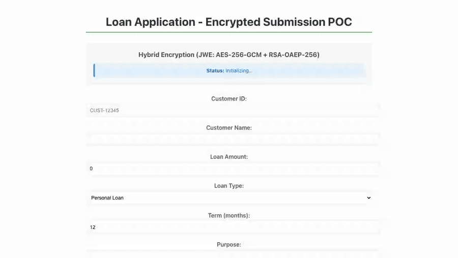
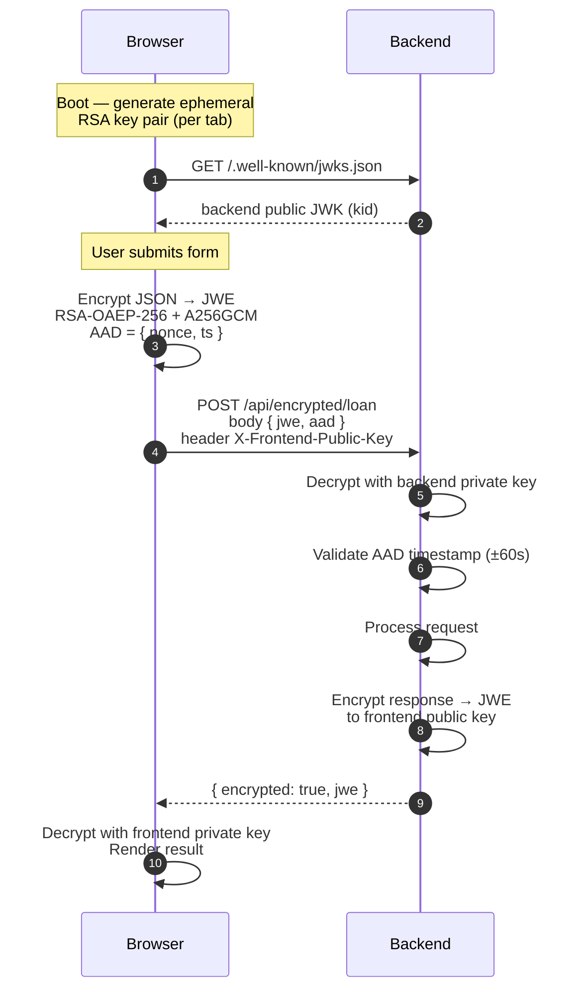

# e2e-payload-encryption-starter

> Reference implementation of end-to-end encrypted request/response payloads between a React frontend and a Quarkus backend — designed to be read and extended by humans **and** AI agents.

[](https://github.com/Hustree/e2e-payload-encryption-starter/actions/workflows/backend-ci.yml)
[](https://github.com/Hustree/e2e-payload-encryption-starter/actions/workflows/frontend-ci.yml)
[](https://github.com/Hustree/e2e-payload-encryption-starter/actions/workflows/codeql.yml)
[](LICENSE)



## What this is

A small, opinionated reference implementation showing how to encrypt JSON payloads **in both directions** between a browser and an API server — surviving TLS termination, proxy logs, CDN inspection, and infrastructure-level MITM. The wire format is [JWE compact serialization (RFC 7516)](https://www.rfc-editor.org/rfc/rfc7516) with a hybrid envelope of **RSA-OAEP-256** (key wrap) + **AES-256-GCM** (content encryption).

The project is sized as a **coding-standards exemplar** — small enough that an AI agent can model the entire codebase in context, large enough to demonstrate the real pattern.

## How it works in 30 seconds



No plaintext ever crosses the wire in either direction.

## Is vs. isn't

**Is:** application-layer encryption of request *and* response payloads between a specific frontend and backend. Protects against TLS-terminating proxies, CDN logs, WAF request inspection, sidecar taps, and MITM inside trusted network boundaries.

**Isn't:** user authentication, session management, or persistent key storage. Wrap the encrypted endpoint with your preferred auth layer and source RSA key material from a KMS before shipping to production. See [SECURITY.md](SECURITY.md) for the full list of known limitations.

## Stack

| Layer | Tech |
|---|---|
| Backend | Java 17, Quarkus 3, Nimbus JOSE+JWT, commons-codec, JUnit 5, REST-Assured |
| Frontend | React 19, TypeScript, Create React App, [`jose`](https://github.com/panva/jose) library, axios, Playwright |
| CI | GitHub Actions, CodeQL (Java + TS), Dependabot (Maven + npm + Actions) |

## Quick start

```bash
git clone https://github.com/Hustree/e2e-payload-encryption-starter.git
cd e2e-payload-encryption-starter
./scripts/dev.sh
```

Then open http://localhost:3000.

- Backend alone: `cd backend && ./mvnw quarkus:dev` → http://localhost:8080
- Frontend alone: `cd frontend && npm install && npm start` → http://localhost:3000
- Headless smoke test: `cd scripts && npm install && npm run smoke`

## Features

- **Bidirectional JWE.** Requests encrypted to backend public key; responses encrypted to a per-session frontend public key carried in the `X-Frontend-Public-Key` header. Neither plaintext ever crosses the wire.
- **Hybrid envelope encryption.** One RSA operation per direction regardless of payload size; AES-256-GCM handles content at hardware speed — ~200µs encryption latency.
- **Replay protection.** AEAD-bound `{ nonce, ts }` AAD block with ±60s server-side validation. Tampering breaks decryption.
- **JWKS-based key distribution.** Frontend fetches backend public key from `/.well-known/jwks.json` at boot. Backend `kid` rotates on restart; frontend refetches transparently.
- **Ephemeral frontend keys.** Each tab generates its own RSA key pair; responses can only be decrypted by the exact session that sent the request.
- **Typed end to end.** Java records ↔ TypeScript interfaces; no untyped JSON in the crypto path.

## Repo layout

```
e2e-payload-encryption-starter/
├── backend/                 Quarkus + Nimbus JOSE+JWT service
├── frontend/                React + jose-library app
├── docs/                    Architecture, API, ADRs, encryption primer, glossary
│   ├── adr/                 Architecture Decision Records
│   └── assets/              README images (demo.gif, hero.png)
├── demo/sample-requests/    .http fixtures for the REST endpoints
├── scripts/dev.sh           Run backend + frontend concurrently
├── scripts/smoke-e2e.mjs    Headless bidirectional roundtrip test
├── CLAUDE.md                Agent orientation (root)
├── LICENSE                  MIT
└── .github/                 CI workflows, Dependabot, templates
```

## Documentation

- [Architecture](docs/architecture.md) — layers, mermaid sequence diagram, key lifecycle
- [Getting Started](docs/getting-started.md) — setup, dev loop, troubleshooting
- [API Reference](docs/api.md) — endpoints with JWE examples
- [Configuration](docs/configuration.md) — every backend + frontend knob
- [Encryption Explained](docs/encryption-explained.md) — beginner-friendly walkthrough of hybrid encryption
- [Glossary](docs/glossary.md) — jargon dictionary (RSA-OAEP, AES-GCM, JWE, JWKS, AAD, kid)
- [ADRs](docs/adr/) — Architecture Decision Records
- [PRD](docs/prd.md) — original product requirements document

## For AI agents

Start with [`CLAUDE.md`](CLAUDE.md). Each major directory (`backend/`, `frontend/`) has its own `CLAUDE.md` with local conventions. Rules, conventions, and "what not to do" live there — not scattered across code comments.

## Contributing

See [CONTRIBUTING.md](CONTRIBUTING.md). Commits follow Conventional Commits. All PRs require green CI.

## Security

Vulnerabilities: see [SECURITY.md](SECURITY.md). Do **not** open a public issue for a vulnerability.

## License

MIT — see [LICENSE](LICENSE).
