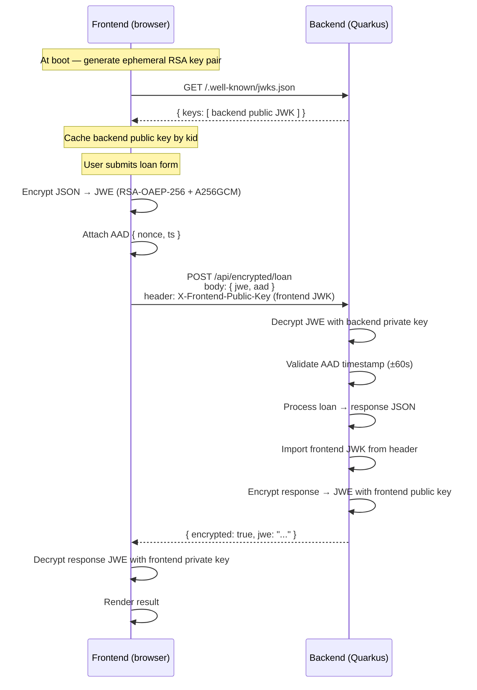

# Architecture

## Overview

This project is a reference implementation of **end-to-end encrypted request/response payloads** between a browser and an API server. Both directions use the [JWE compact serialization](https://www.rfc-editor.org/rfc/rfc7516) with an envelope of **RSA-OAEP-256** (key wrap) and **AES-256-GCM** (content encryption).

Two deployables:

- **`backend/`** — Quarkus 3 + Java 17 + Nimbus JOSE+JWT. Serves a JWKS endpoint, accepts encrypted loan applications, and returns encrypted responses.
- **`frontend/`** — React 19 + TypeScript. Generates a per-session key pair, fetches the backend public key from JWKS, encrypts the request, and decrypts the response.

## Bidirectional flow



## Why end-to-end, not just TLS?

TLS only protects data between the browser and whatever terminates TLS — typically a load balancer, CDN, or reverse proxy. Once terminated, the plaintext is visible to every intermediary in the request path: access logs, WAFs, sidecars, and any compromised node between the edge and the application container.

End-to-end payload encryption defends against:

- TLS-terminating proxies or CDNs logging request bodies
- Sidecar containers or service meshes with request inspection
- Infrastructure-level MITM inside a trusted network boundary
- Accidental plaintext in error logs, APM traces, or debug dumps

TLS still matters — it provides transport integrity, authenticity of the backend hostname, and protects metadata (headers, URL). JWE sits on top, not instead.

## Backend package layout

```
com.example
├── crypto/
│   ├── RSAKeyManager.java          generates + serves the backend RSA key pair
│   ├── HybridEncryptionService.java JWE encrypt/decrypt (Nimbus JOSE+JWT)
│   └── AESCryptoService.java       legacy AES-CBC path (documented for comparison)
├── model/
│   ├── EncryptedPayload.java       { jwe, aad { nonce, ts } }
│   └── LoanApplication.java        decrypted domain record
└── resource/
    ├── JWKSResource.java           GET /.well-known/jwks.json
    └── EncryptedLoanResource.java  POST /api/encrypted/loan, GET /api/encrypted/health
```

## Frontend folder layout

```
frontend/src
├── App.tsx                         shell
├── components/
│   └── LoanApplicationForm.tsx     form + submit + render result
└── services/
    ├── hybridEncryptionService.ts  JWE encrypt/decrypt (jose library)
    └── encryptionService.ts        legacy AES-CBC path
```

## Keys — who holds what

| Key | Owner | Lifecycle | Exposed via |
|---|---|---|---|
| Backend RSA private key | Backend process memory | Per-process (not persisted in this POC) | Never leaves the backend |
| Backend RSA public key | Backend → JWKS | Rotated by restart | `GET /.well-known/jwks.json` |
| Frontend RSA private key | Browser memory | Per tab/session | Never leaves the browser |
| Frontend RSA public key | Frontend → HTTP header | Per request | `X-Frontend-Public-Key` header (JWK) |
| Content AES-256 key | Generated fresh each call | Single message | Wrapped by RSA into JWE |

The AES key is **ephemeral per payload** — each request generates a new one, wraps it with the peer's RSA public key, and discards it after encryption. This is the envelope pattern; it keeps expensive RSA ops to exactly one per direction regardless of payload size.

## Replay protection

Every request carries an AAD block `{ nonce, ts }` that is:

- Integrity-protected by the GCM auth tag (tampering breaks decryption)
- Validated server-side: `ts` must be within ±60s of server time
- Nonce uniqueness is not enforced in this POC — add a short-TTL nonce store in production

## What this repo does NOT do (by design)

- **No user authentication.** There is no login, session, or bearer token. Add your preferred auth layer (JWT, OIDC) as middleware before the encrypted endpoint in production.
- **No persistent key storage.** Keys live in process memory and reset on restart. Wire a KMS (AWS KMS, Google Cloud KMS, HashiCorp Vault) before shipping.
- **No rate limiting.** A determined attacker can still overwhelm the service with malformed JWEs. Put it behind a rate-limiting reverse proxy.
- **No audit log.** Successful/failed decryption attempts are not persisted. Emit structured logs + forward to SIEM in production.

See [`adr/`](adr/) for the reasoning behind specific design decisions.
